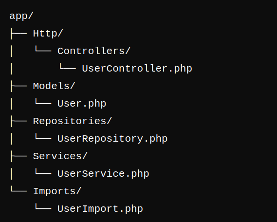

# Laravel Scaffold

Laravel Scaffold is a powerful artisan command package designed to streamline the process of generating boilerplate code for CRUD operations in your Laravel applications. With the ability to create models, controllers, services, repositories, and import classes, this package enhances your productivity by automating repetitive tasks.

### Features

* **CRUD Generation**: Quickly scaffold models, controllers, services, and repositories with just a single command.
* **Modular Support**: Optionally organize your code into modules for better structure in larger applications.
* **Mass Upload Functionality**: Easily handle bulk data imports from CSV or Excel files using integrated import classes.
* **Customizable Stubs**: Publish and customize stub files to fit your coding style and project requirements.

### Installation

To get started, simply require the package via Composer:

`composer require ahert/laravel-scaffold`

Then, publish the stubs for customization:

`php artisan vendor:publish --tag=stubs`

### Usage

run `php artisan list` to see the list of available commands `laravel-scaffold` should in the list. If you sight `laravel-scaffold` in the list of available commands then you are good to go.

As of the initial release `laravel-scaffold` assumes that you already have the database for your application carefully designed and implemented with all necessary indexes, keys and relationships put in place.

Setup the database parameters within you `.env` file before proceeding to use `laravel-scaffold`. With that said and ensure you can then start working on you application.

Then to scaffold Controller, Service, Repository and Model for a particular entity (table) run this command:

`php artisan laravel:scaffold User --table=users`

the command above assumes there is an existing `users` which will be looked up and the structure (columns and other properties) of the read to be able to create the various piece of code required to have a functional application. There are other optional flags that can be passed into the command.

`--mass_upload`: this will scaffold an additional function to handle mass upload of data to the database table from `csv`, `xls`, and `xlsx` files. Tab separated values would be include in future release.

`--module`: this will modularise your application

`php artisan laravel:scaffold User --module=User --table=users --mass_upload`

Here is the folder/directory structure for a simple application not made into modules.

The directory structure for a modularized application

`"repositories":[
    {
        "type":"path",
        "url":"/home/netplus/Documents/Abayomi/AHERTL/laravel-scaffold","options":{
            "symlink":true
        }
    }
]`

Update token for packagist webhook
